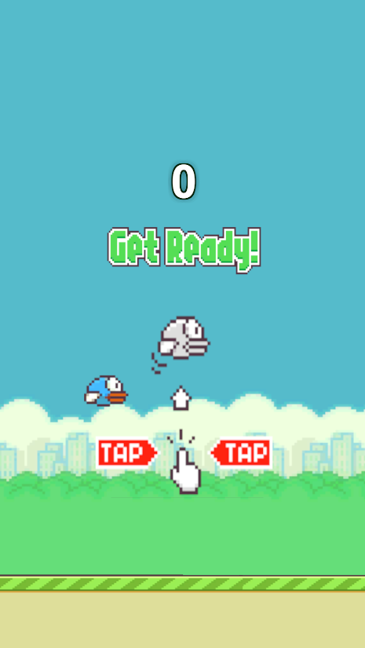
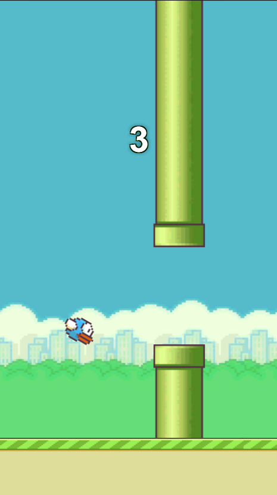
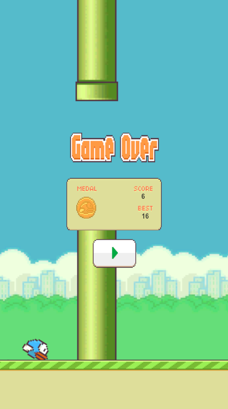

# Flappy Bird Clone - Educational Project

A personal educational project recreating Flappy Bird mechanics in Unity for learning purposes.

## Disclaimer
⚠️ **This is an educational project only**  

## Project Goals
- Learn Unity 2D physics
- Implement game state management
- Practice object pooling techniques
- Understand collision detection
- Create a complete game loop

##  Demo
### 🏠 Main Menu


- Tap the page to start game using left mouse click


### 🎮 In-Game


- Click-to-flap controls
- Infinite procedural pipes and floors
- Real-time score
- Flap particles

### 🏁 Game Over


- Final score display
- Medal system (bronze/silver/gold)
- Restart button
- New best indicator

  
## Installation
1. Requires Unitor Editor Version 6000.0.10f1 or later
2. Clone repository:
   ```bash
   git clone https://github.com/aiyayayah/FlappyBird.git
